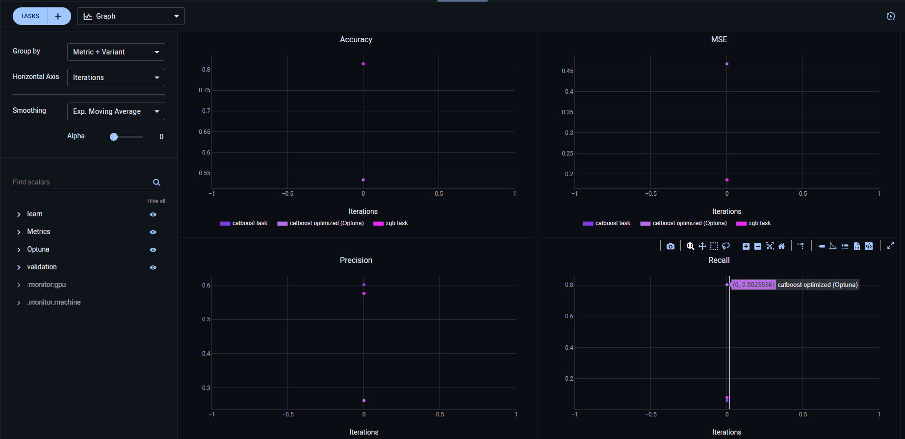

# aith_mlops

Репозиторий для обучения LoRa-адаптеров для Qwen2.5-VL для распознавания документов на русском языке

## Repo Workflow

Для разработки используем GitHub Flow.

Одна стабильная ветка — `main`.

Для любых изменений создается ветка от `main`. Название ветки отражает содержимое фичи.

После готовности фичи она пушится в репозиторий и создается `Pull Request`. Необходимо выполнить прогон линтеров и провести ревью кода. Все изменения вливаются в `main`.

## Трекинг экспериментов

### Установка

В качестве трекера для экспериментов используется ClearML.

Для развертывания используется пакет `clearml`. Установка через poetry:

```sh
poetry add clearml
```

Подробнее об установке по [ссылке](https://clear.ml/docs/latest/docs/clearml_sdk/clearml_sdk_setup).

### Использование

В коде необходимо импортировать пакет и создать объект `Task`:

```py
from clearml import Task

task = Task.init(project_name='great project', task_name='best task')
```

Логирование метрик:

```py
logger = task.get_logger()
logger.report_scalar(title="Metrics", series=metric_name, value=metric_value, iteration=0)
```

Логирование артефактов:

```py
logger = task.get_logger()
task.upload_artifact(name="test_data", artifact_object=DATA_PATH + "flight_delays_test.csv")
```

Сохранение параметров:

```py
task.connect(best_params, name="Best Parameters")
```

Данные загружаются локально с использованием LakeF, развернутого раннее в Docker.

### Сравнительный анализ

ClearML позволяет строить графики прямо из веб-интерфейса:



Более подробный сравнительный анализ приведен в `notebooks/model_comparasion.ipynb`.

## Работа с версионированием данных 

Для версионирования используется LakeFS, поднятый с помощью Docker Compose.

Для работя локально должна быть установлена утилита [lakectl](https://docs.lakefs.io/reference/cli.html#installing-lakectl-locally).

Начальная конфигурация CLI:

```sh
lakectl config
```

Список доступных репозиториев:

```sh
lakectl repo list
```

Нужно создать бакет в S3 для создания репозитория:

```sh
lakectl repo create lakefs://repository s3://bucket_name
```

Создание новой ветки в репозитории

```sh
lakectl branch create lakefs://repository/branch_name --source lakefs://repository/source_branch_name
```

Создание коммита:

```sh
lakectl commit lakefs://repository/branch_name -m "Create a dataset"
```

Merge веток:

```sh
lakectl merge lakefs://repository/branch_name --source lakefs://repository/main
```

Для того, чтобы работать с датасетом локально, нужно воспользоваться `lakefs local`.

Клонирование раннее созданой ветки локально:

```sh
lakectl local clone lakefs://repository/branch_name/directory_name/  local_directory_name
```
В данном репозитории

```sh
lakectl local clone lakefs://repository/main/  flights_data
```

Проверка, что все корректно связалось:

```sh
lakectl local list
```

Просмотр локальных изменений по сравнению с remote: 

```sh
lakectl local status local_directory_name
```

Коммит изменений, все закомиченные изменения появляются в remote:

```sh
lakectl local commit -m "commit message" local_directory_name
```

## Работа с линтерами и форматтерами

Должны быть установлены зависимости из группы dev. Если нет, то надо выполнить команду:

```sh
poetry install --with dev
```

Для прогона всех линтеров и форматтеров перед коммитом можно выполнить команду:

```sh
poetry run pre-commit run --all-files
```

Для ручного прогона по отдельности подойдет одна из команд:

```sh
poetry run black .
```

```sh
poetry run flake8 .
```

```sh
poetry run isort .
```

## Запуск обучения

Необходимо собрать контейнер и указать тег:

```sh
docker build -t flights:hw1 .
```

```sh
docker run -it flights:hw1
```

Внутри контейнера запустить обучение и расчет на валидационном датасете:

```sh
python aith_mlops/train.py
```

Или одной командой:

Пример вывода:

```sh
desktop:~/mlops/aith-mlops$ docker run --rm flights:hw1 python aith_mlops/train.py
Запуск обучения
Данные получены
Обучение модели
Результат обучения:
Accuracy: 0.8141333333333334
Precision: 0.5763358778625954
Recall: 0.07952949438202248
MSE: 0.18586666666666668
ROC-AUC: 0.6928563540426138
```
